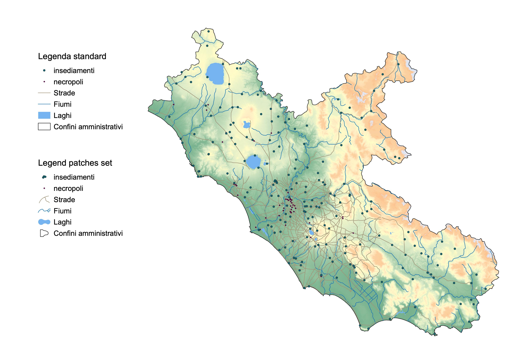
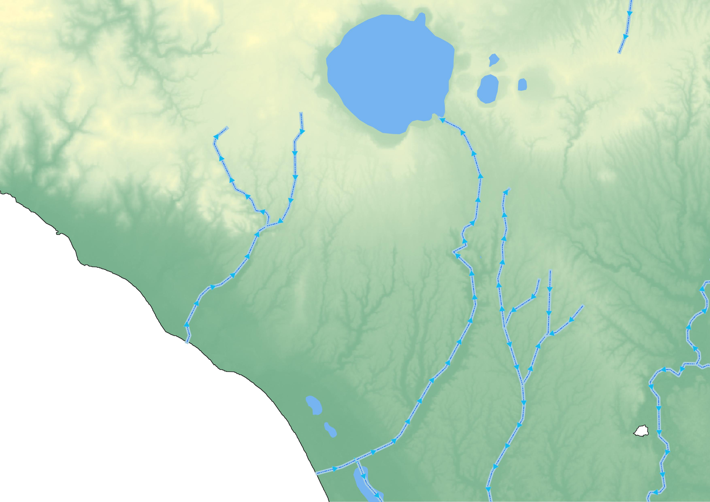

I **Sistemi Informativi Geografici** (GIS) sono un mondo vasto e spesso complesso da affrontare e saper gestire. In questo articolo vi suggeriamo alcune **risorse open source** che possono correre in aiuto di utenti di vari gradi e livelli. **L'elenco è in continuo aggiornamento** ed è incentrato sulle risorse disponibili per il software **QGIS**!

## QGIS HUB

[**QGIS Hub**](http://qgis-hub.fast-page.org/index.php#) è un repository che ospita una serie di risorse open source per QGIS. Attualmente il sito è diviso due sezioni (Layout-Hub e Style-Hub) rispettivamente per la pubblicazione di layout e stili da utilizzare nei propri progetti GIS. QGIS Hub è stato ideato ed è mantenuto da [**Klas Karlsson**](https://twitter.com/klaskarlsson). Le risorse sono distribuite (e devono essere rilasciate) con una **licenza Creative Commons 0 (CC-0)**.

- [**Layout-Hub**](http://qgis-hub.fast-page.org/layouts.php) fornisce la possibilità di scaricare gratuitamente una serie di layout predefiniti e dal design molto curato per la pubblicazione di tavole cartografiche  tramite QGIS. Attualmente i layout proposti sono 12 e sono stati tutti pubblicati da Klas Karlsson. È possibile inviare i propri template in modo da renderli pubblici e fruibili da tutta la comunità di QGIS. Le linee guida per la creazione e pubblicazione di un template da sottoporre a QGIS Hub sono [delineate nel sito](http://qgis-hub.fast-page.org/index.php).
- [**Style-Hub**](http://qgis-hub.fast-page.org/styles.php) fornisce la possibilità di scaricare e importare gratuitamente una serie di stili e simbologie predefinite in formato .xml. Attualmente gli stili proposti sono stati pubblicati da vari autori. È possibile inviare i propri stili in modo da renderli pubblici e fruibili da tutta la comunità di QGIS. Le linee guida per la creazione e pubblicazione di uno stile da sottoporre a QGIS Hub sono [delineate nel sito](http://qgis-hub.fast-page.org/index.php).

## QGIS Resource Sharing

Il plugin [**QGIS Resource Sharing**](https://plugins.qgis.org/plugins/qgis_resource_sharing/), ideato da **Akbar Gumbira** e **Håvard Tveite**, è un grande contenitore di collezioni di simbologie, immagini, stili, processing scripts, processing models e script R tutti utilizzabili in QGIS. Il download del plugin da accesso a un elenco di tutti repository in cui sono pubblicati questi data sets, con un'anteprima del loro contenuto. Una volta trovato il repository di interesse è possibile scaricarlo e utilizzarlo nel proprio progetto.

## QGIS Style

[**QGIS Style**]((https://plugins.qgis.org/styles/?page=1&&order_by=-upload_date&&is_gallery=true&&)) è un repository ufficiale di QGIS dove è possibile scaricare e pubblicare diverse tipologie di stili da utilizzare nel proprio progetto GIS (Color ramp, riempimenti, linee, legend patch styles e marker).
Il data set è veramente consistente, attualmente l'elenco conta 114 record tra librerie di stili di "nicchia" e più famose, come, ad esempio, quella delle icone Mapbox.  
Ci sentiamo di segnalare, per le tematiche affrontate in questo blog, alcune librerie specifiche che ci sembrano piuttosto interessanti:

- [Basi Legend Patches Set](https://plugins.qgis.org/styles/9/);
- [HLURB Land Use Categories and Color Coding (2014)](https://plugins.qgis.org/styles/62/);
- [Italian regions](https://plugins.qgis.org/styles/7/);
- [Measure Line](https://plugins.qgis.org/styles/5/);
- [Polygons with measurements](https://plugins.qgis.org/styles/21/);
- [Water Flow](https://plugins.qgis.org/styles/60/).

La lista non si esaurisce sicuramente con queste voci, che vogliono essere solo uno spunto delle possibilità offerte da questa risorsa completamente open source con **licenza Creative Commons Attribution-ShareAlike 3.0 licence (CC BY-SA)**.

---

## Guida 1: download, importazione e uso dello stile `legend patches set`

1. Scaricare il pacchetto dal repository di QGIS Style al link [https://plugins.qgis.org/styles/9/](https://plugins.qgis.org/styles/9/).
1. Una volta effettuato il download decomprimere la cartella zip `basic-legend-patches-set.zip`. Si otterrà una cartella denominata `Basic Legend Patches Set`.
1. **Utilizzare la risorsa in un layout in QGIS**:
   1. Aprire il progetto GIS;
   1. Nel pannello dei `Layer` selezionare uno dei layer vettoriali presenti;
   1. Nel `Pannello delle proprietà del layer` selezionare la voce `Simbologia` nel menù verticale a sinistra;
   1. Selezionare la funzione `Style manager`;
   1. Dallo `Style manager` importare il file `patch.xml` contenuto nella cartella `Basic Legend Patches Set`;
   1. Potete utilizzare questo nuovo set di icone aggiungendo la legenda dei layer contenuti nel vostro progetto GIS in un `layout di stampa` e modificando, sotto la voce `Elementi della legenda`, l'icona di ogni singolo file vettoriale cliccando due volte sul simbolo desiderato.

## Guida 2:  download, importazione e uso dello stile `water flow`

1. Scaricare il pacchetto dal repository di QGIS Style al link [https://plugins.qgis.org/styles/60/](https://plugins.qgis.org/styles/60/).
1. Una volta effettuato il download decomprimere la cartella zip `water-flow.zip`. Si otterrà una cartella denominata `Water Flow`.
1. **Utilizzare la risorsa in un layout in QGIS**:
   1. Aprire il progetto GIS;
   1. Nel pannello dei `Layer` selezionare uno dei layer vettoriali presenti;
   1. Nel `Pannello delle proprietà del layer` selezionare la voce `Simbologia` nel menù verticale a sinistra;
   1. Selezionare la funzione `Style manager`;
   1. Dallo `Style manager` importare il file `water-flow.xml` contenuto nella cartella `Water Flow`;
   1. Potete utilizzare questa simbologia selezionando nel vostro progetto GIS il layer di linee/polilinee che rappresenta l'idrografia del territorio oggetto di studio e applicando la simbologia `water flow` che troverete ora nell'elenco delle simbologie disponibili per le geometrie di linee.  
