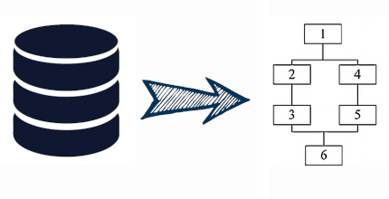
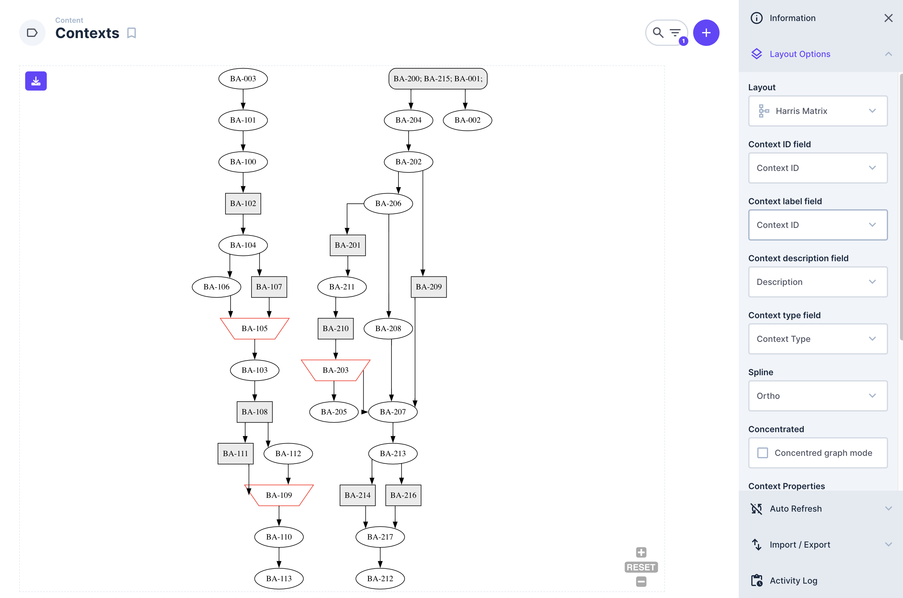

Gli scavi di [Çuka e Ajtoit](https://lad.saras.uniroma1.it/ricerca/missione-archeologica-sapienza-a-cuka-e-ajtoit-albania/), in Albania, stanno sperimentando [Directus.io](https://directus.io). La piattaforma è utilizzata per lo raccolta dei dati prodotti dallo studio dei siti. Fra questi dati, naturalmente, figura quello stratigrafico. La visualizzazione tabellare di questa tipologia di rilievo è scomoda e poco utile. Per questo motivo si è cercato di estendere Directus in modo da rappresentare le stratigrafie rilevate nella forma dell'*Harris Matrix*, formato certamente più utile e consueto.

## Directus.io

*Directus.io* è una piattaforma intesa per rendere accessibili i database relazionali ad utenti non necessariamente dotati di particolari capacità tecniche. Secondo la definizione dello stesso team che lo sviluppa:

> Directus is an Open Data Platform built to democratize the database.

Il principale uso che se ne può fare su uno scavo è quello di facilitare le operazioni di *data entry* anche a quegli operatori non dotati di formazione (informatica) specifica. *Directus.io* è uno strumento a sorgente aperta (_open source_), estremamente supportato e (sotto certe condizioni) utilizzabile gratuitamente. Potenzialmente, quindi, rappresenta una soluzione notevole ed accessibile per le fasi di raccolta del dato. Se configurato bene, le maschere intuitive della piattaforma possono facilitare l'immissione contestuale di quanto serva registrare durante gli interventi in cantiere, senza che questo rappresenti una ulteriore complicazione per chi opera.

## La stratigrafia come costrutto relazionale

Per quanto riguarda la stratigrafia è molto semplice immaginare una struttura tabellare più o meno complessa che possa accogliere i record inerenti alle caratterisctiche delle unità stratigrafiche ma anche, e soprattutto, la loro mutua relazione fisica. Il paradigma relazionale è egemone quando si tratta di immagazzinare questo tipo di dato, e *Directus.io* consente di creare schemi assolutamente adatti a questa esigenza.

*Directus.io*, però, non è stato progettato per assolvere specificatamente al trattamento del dato stratigrafico. È, anzi, una piattaforma *general purpose* estremamente versatile e quindi totalmente generica. Perchè una istanza di *Directus.io* possa *orientarsi* verso le necessità proprie di uno scavo archelogico, essa dovrà essere estesa.

## I _custom layout_

Naturalmente la prima e più immediata esigenza di cui prendersi cura è quella della visualizzazione del dato. Il fatto che la visualizzazione a *Matrix di Harris* sia da preferirsi alla arida rappresentazione tabulare è evidente. 

_Directus.io_ consente un'ampia gamma di Layout associabili al dato, e questo significa che qualunque tabella può essere presentata in uno dei formati predefiniti, a patto di configurare i layout in modo che sappiano come semantizzare il dato conenuto nei record. I layout originari sono `Calendar`, `Cards`, `Kanban`, `Map` e `Table` che è il predefinito. Una volta selezionato il layout di nostro interesse bisognerà semplicemente indicare alla piattaforma quale colonna del record dovrà valorizzare il particolare elemento grafico della rappresentazione scelta. Ad esempio, se scegliamo il layout *Map* e la nostra tabella possiede delle colonne relative alla localizzazione geografica del record, allora basterà indicare quale di esse debba essere considerata la fonte del dato latitudinale e quale quella del dato longitudinale del marker che rappresenterà il dato.

Poniamo il caso di una tabella che possiede due record geolocalizzati. 

La rappresentazione tabellare non è l'unica disponibile

Nelle immagini precedenti vediamo come il semplice uso della funzionalità di _layouting_ di _Directus.io_ permetta di passare da una ostica e fredda forma tabellare ad una interessantissima rappresentazione su mappa. Fortunatamente questo meccanismo è estendibile e come vedremo è stato possibile produrre un layout aggiuntivo che permette di visualizzare i dati sotto forma di _Harris Matrix_. _Directus.io_ si riferisce a questo tipo di estensioni col termine _[Custom layouts](https://docs.directus.io/extensions/layouts.html)_.

## L'HMDE

L'_Harris Matrix Directus Extension_ (HMDE) è quindi un _Directus.io_ custom layout che si occupa di rappresentare il dato stratigrafico nella forma più consueta per gli archeologi odierni. Basterà, come detto, indicare alla piattaforma quali colonne sono depositarie di dati quali l'identificativo dell'Unità Stratigrafica, la sua descrizione, etc.

Bisognerà inoltre rispettare alcune specifiche nella fase di modellizzazione delle tabelle che si vogliono rappresentare. Queste specifiche vengono descritte in un [video tutorial](https://youtu.be/yEDQMQqO87I?si=cLKAWpcfR4NtguwU) accessibile anche dalla [pagina GitHub](https://github.com/lab-archeologia-digitale/directus-extension-harris-matrix) del progetto (e che contiene anche le istruzioni per l'installazione dell'estensione in una eventuale istanza dockerizzata di _Directus.io_) e che si può seguire anche qui sotto.

  <iframe src="https://www.youtube.com/embed/yEDQMQqO87I?si=-mzL63fyRVUMVFVK" title="YouTube video player" frameborder="0" allow="accelerometer; autoplay; clipboard-write; encrypted-media; gyroscope; picture-in-picture; web-share" referrerpolicy="strict-origin-when-cross-origin" allowfullscreen></iframe>

Attualmente il node module già compilato è disponibile alla [pagina delle releases](https://github.com/lab-archeologia-digitale/directus-extension-harris-matrix/releases) di HMDE ma a breve sarà pubblicato anche presso il free NPM.js *registry*, sotto l'[egida del LAD](https://www.npmjs.com/org/lad-sapienza). 

## _Where can we go from here_?

L'HMDE è un progetto (ancora) poco raffinato e che certamente non sfrutta tutte le potenzialità emerse durante i mesi di analisi e sviluppo. Molte migliorie potranno essere apportate in modo che l'estensione garantisca sempre miglior risposta alle richieste delle operatrici e degli operatori sullo scavo. Soprattutto, molte considerazioni teoriche che sono state appena abbozzate potranno essere approfondite ed impiegate sul percorso verso evoluzioni che magari, oggi, non riusciamo ancora a vedere.

Vorremmo concludere questo contributo accennando proprio ad un ambito che durante lo sviluppo è stato certamente trattato, ma non approfondito quanto ci sarebbe piaciuto: l'applicazione della [Teoria dei Grafi](https://www.treccani.it/enciclopedia/teoria-dei-grafi_(Enciclopedia-della-Scienza-e-della-Tecnica)/) al trattamento della rappresentazione stratigrafica. Non è questo il luogo che consenta più di un vago accenno, ma l'idea che un *Harris Matrix*, per essere tale, debba essere concepito come la _[Transitive reduction](https://www.cs.tufts.edu/comp/150FP/archive/al-aho/transitive-reduction.pdf)_ di un [grafo orientato](https://www.britannica.com/topic/graph-theory#ref909835) aciclico ci ha quasi obbligato ad invadere il campo della matematica. Una volta penetrati in quel territorio ci si è presentata una serie ampia ed affascinante di possibilità. 

Di queste possibilità, come accennato, siamo riusciti a sfiorare soltanto la superficie: speriamo di poter tornare su questi argomenti nel mnor tempo possibile.

*Stay tuned* 
